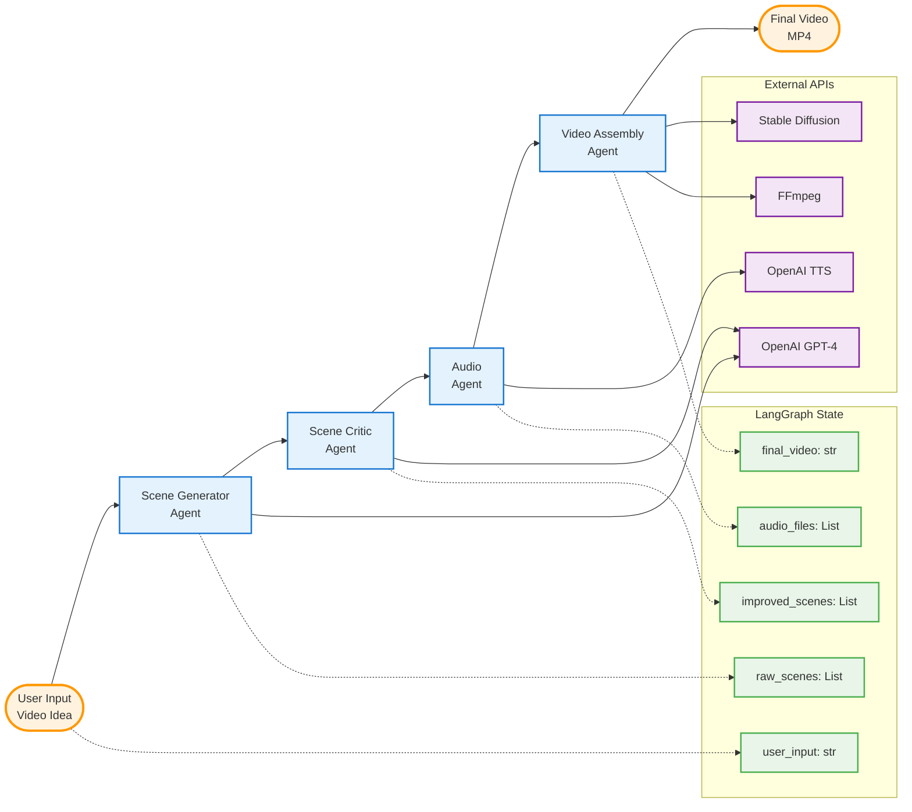

# July 11

https://app.readytensor.ai/publications/WsaE5uxLBqnH
Submission Checklist ✅
To complete this project, you need to submit two deliverables:

Project Publication 📝
Create a short publication on the Ready Tensor platform that:

Describes your project, what it does, and how it works
Follows best practices from our Technical Evaluation Rubric for the
Tool / App / Software Development category
Meets at least 70% of the listed criteria


Project GitHub Repository 🗂️
Submit a repo that:

Contains clean, working code for your multi-agent system
Defines roles and communication flows between agents
Includes setup instructions and sample interactions
Meets the “Essential” level of our repo evaluation rubric
Satisfies at least 70% of the Essential criteria


# My Project idea
agentic ai video generator

user types in about the video idea and give context ```->```
ai takes the idea and generate video scene based on prompt configuration
```->```
crtiic the scene to improve it with ai and human
```->```
generate audio for each scene
```->```
generate the video





Title: "The Ancient Origins of Coffee: Ethiopia's Gift to the World"
Description: "Discover how coffee was first discovered in the highlands of Ethiopia over 1,000 years ago. From the legendary goat herder Kaldi who noticed his goats becoming energetic after eating coffee berries, to how Ethiopian monks used coffee to stay alert during prayers. Learn about the ancient coffee ceremonies that still exist today and how this magical bean spread from Ethiopia to Yemen, then to the rest of the world."