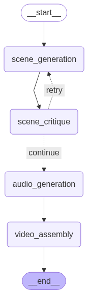

# AI Video Generator

A simple AI video generator that creates videos with text and audio narration from any description.

## How It Works



The system uses 4 AI agents with integrated database logging:

1. **Scene Generator** - Creates video scenes from your input
2. **Database Logger** - Saves scenes and logs progress to database using custom tools
3. **Scene Critic** - Improves and refines the scenes  
4. **Audio Agent** - Generates narration audio
5. **Video Agent** - Combines text visuals with audio into final MP4

### Database Tools Integration

The workflow includes custom database tools for comprehensive logging:

- **`save_scene_progress`** - Saves raw and improved scenes to database
- **`log_progress_event`** - Logs detailed progress events for each workflow step
- **`get_video_context`** - Retrieves video context for enhanced scene generation
- **`search_similar_videos`** - Finds similar videos for creative inspiration

All progress is automatically tracked in the database, providing complete audit trails and enabling recovery from failures.

## Quick Start with Docker

1. **Clone and setup:**
   ```bash
   cd project-2
   mkdir -p data outputs temp
   ```

2. **Add your OpenAI API key:**
   ```bash
   # Create .env file
   echo "OPENAI_API_KEY=your_api_key_here" > .env
   ```

3. **Run with Docker:**
   ```bash
   docker-compose up --build
   ```

4. **Open in browser:**
   ```
   http://localhost:3000  # Frontend
   http://localhost:5000  # API
   ```

## Usage

### Web Interface
- Open `http://localhost:3000`
- Enter a description like "Create a video about coffee origins"
- Watch real-time progress as the AI generates your video
- View detailed progress logs and scene data in the database

### API Example
```bash
curl -X POST http://localhost:5000/api/videos \
  -H "Content-Type: application/json" \
  -d '{
    "title": "Coffee Origins",
    "description": "A video about coffee history",
    "user_input": "Create a video about how coffee was discovered in Ethiopia"
  }'
```

### Running Tests

```bash
# From repo root
cd project-2/backend

# (Optional) create and activate a virtualenv
python3 -m venv .venv && source .venv/bin/activate

# Install backend deps
pip install -r requirements.txt

# Recommended for deterministic tests (no external API calls)
export MOCK_MODE=true

# Run all tests (coverage configured via pytest.ini)
python3 -m pytest -q

# Run a single test
python3 -m pytest tests/integration/test_validation_edges.py::test_max_lengths_ok -v

# Show coverage summary (omit -q to print the report)
python3 -m pytest
```

### Database Features

The system automatically tracks and stores:
- **Video metadata** - Title, description, user input, creation timestamps
- **Scene data** - Raw and improved scenes saved as JSON
- **Progress logs** - Detailed step-by-step progress with timestamps
- **Error tracking** - Failed attempts and error messages for debugging
- **Similar video references** - Videos with similar topics for inspiration

Access progress data via API:
```bash
# Get video progress history
curl http://localhost:5000/api/videos/{video_id}/progress

# Get specific video with all scene data
curl http://localhost:5000/api/videos/{video_id}
```

## Example Videos

Try these prompts:
- "Create a video about coffee origins in Ethiopia"
- "Explain how pasta is made step by step"
- "Tell the story of the invention of the telephone"

## Troubleshooting

If you encounter issues:
```bash
# Check logs
docker-compose logs -f backend

# Restart containers
docker-compose down
docker-compose up --build
```