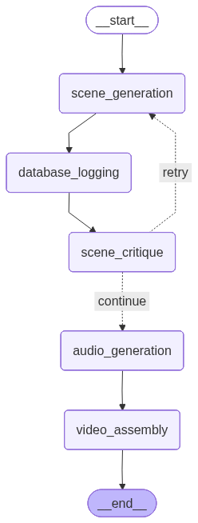

# AI Video Generator

A simple AI video generator that creates videos with text and audio narration from any description.

## How It Works



The system uses 4 AI agents in sequence:

1. **Scene Generator** - Creates video scenes from your input
2. **Scene Critic** - Improves and refines the scenes  
3. **Audio Agent** - Generates narration audio
4. **Video Agent** - Combines text visuals with audio into final MP4

## Quick Start with Docker

1. **Clone and setup:**
   ```bash
   cd project-2
   mkdir -p data outputs temp
   ```

2. **Add your OpenAI API key:**
   ```bash
   # Create .env file
   echo "OPENAI_API_KEY=your_api_key_here" > .env
   ```

3. **Run with Docker:**
   ```bash
   docker-compose up --build
   ```

4. **Open in browser:**
   ```
   http://localhost:3000  # Frontend
   http://localhost:5000  # API
   ```

## Usage

### Web Interface
- Open `http://localhost:3000`
- Enter a description like "Create a video about coffee origins"
- Watch real-time progress as the AI generates your video

### API Example
```bash
curl -X POST http://localhost:5000/api/videos \
  -H "Content-Type: application/json" \
  -d '{
    "title": "Coffee Origins",
    "description": "A video about coffee history",
    "user_input": "Create a video about how coffee was discovered in Ethiopia"
  }'
```

## Example Videos

Try these prompts:
- "Create a video about coffee origins in Ethiopia"
- "Explain how pasta is made step by step"
- "Tell the story of the invention of the telephone"

## Troubleshooting

If you encounter issues:
```bash
# Check logs
docker-compose logs -f backend

# Restart containers
docker-compose down
docker-compose up --build
```