# Creating graph.png for README

To create the workflow diagram referenced in the README, follow these steps:

## Option 1: Using Mermaid Live Editor

1. Go to https://mermaid.live/
2. Paste this mermaid code:

```mermaid
graph TD
    A["👤 User Input<br/>Text description"] --> B["🎬 Scene Generator<br/>Creates video scenes"]
    B --> C["🔍 Scene Critic<br/>Improves scene quality"]
    C --> D["🎵 Audio Agent<br/>Generates narration"]
    D --> E["📹 Video Agent<br/>Assembles final video"]
    E --> F["🎥 Final MP4<br/>Text + Audio"]
    
    style A fill:#e1f5fe
    style B fill:#f3e5f5
    style C fill:#fff3e0
    style D fill:#e8f5e8
    style E fill:#fce4ec
    style F fill:#fff9c4
```



3. Click "Export" → "PNG"
4. Save as `graph.png` in the backend directory

## Option 2: Using Command Line (with mermaid-cli)

```bash
# Install mermaid-cli
npm install -g @mermaid-js/mermaid-cli

# Create graph.mmd file with the mermaid code above
# Then generate PNG
mmdc -i graph.mmd -o graph.png
```

## Option 3: Alternative - Use the rendered diagram

The mermaid diagram was already rendered in the conversation. You can:
1. Screenshot the rendered diagram
2. Save as graph.png
3. Place in the backend directory

The README expects the file to be at `backend/graph.png`. 