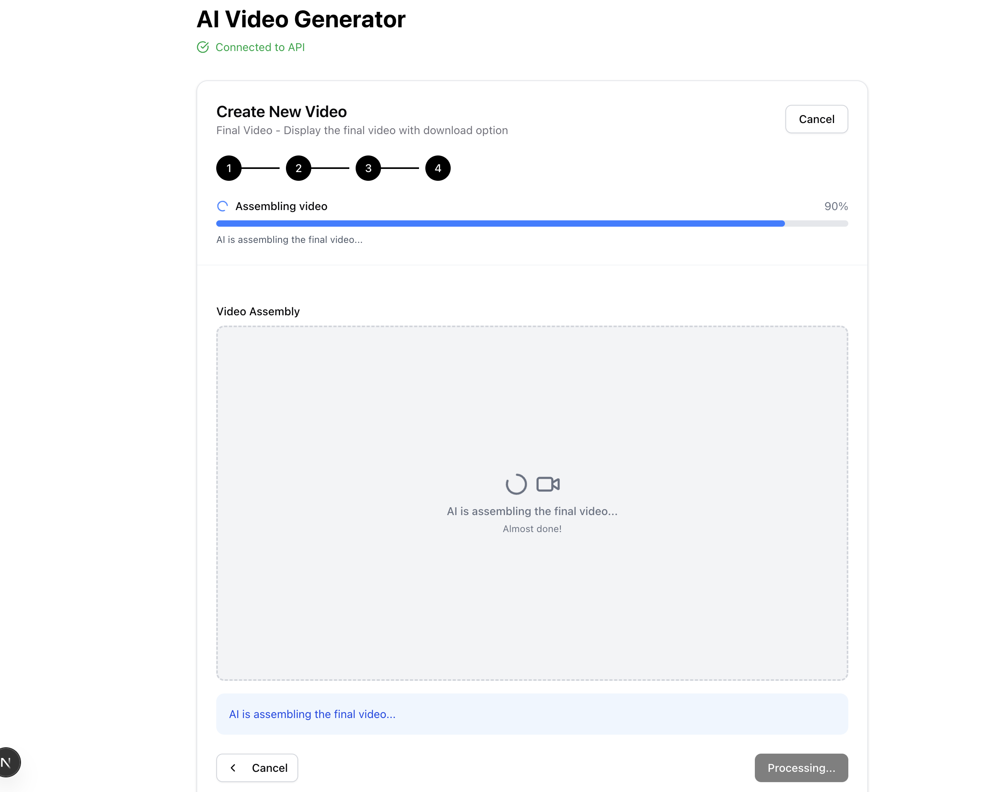
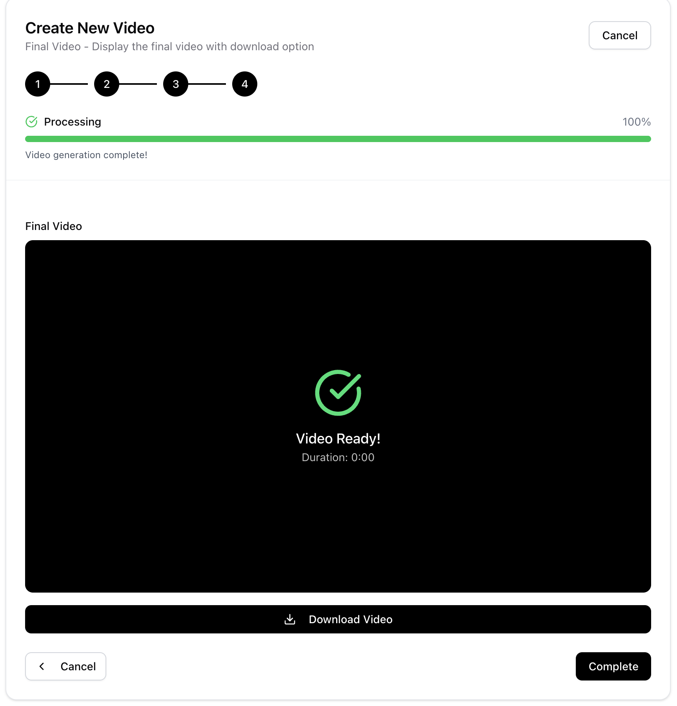
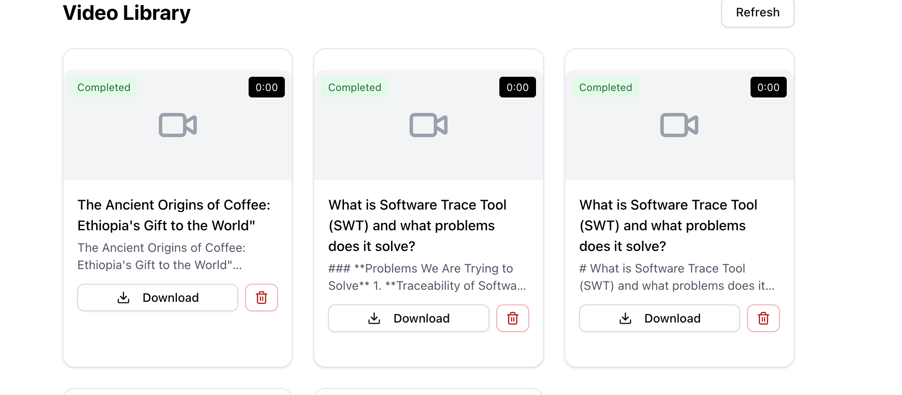

# AI Video Generator - Frontend

A modern Next.js frontend for the AI video generator with real-time progress tracking and video management.

## Features

- **🎬 Video Creation**: Simple form to create videos from text descriptions
- **📊 Real-time Progress**: Watch your video being generated step-by-step
- **📚 Video Library**: Browse and manage all your created videos
- **🎥 Video Player**: Built-in player to preview generated videos
- **📱 Responsive Design**: Works on desktop and mobile devices

## Quick Start

### Run with Docker (Recommended)

```bash
# From project-2 directory
docker-compose up --build

# Open in browser
open http://localhost:3000
```

### Local Development

```bash
# Install dependencies
npm install

# Run development server
npm run dev

# Open in browser
open http://localhost:3000
```

## Usage

### 1. Create a Video
- Click "Create Video" 
- Enter title, description, and your prompt
- Example: "Create a video about coffee origins in Ethiopia"
- Click "Generate Video"

### 2. Watch Progress
- See real-time updates as the AI processes your video
- Progress bar shows completion percentage
- Steps: Scene Generation → Scene Critique → Audio Generation → Video Assembly

### 3. View Results
- Generated videos appear in the library
- Click to play videos directly in the browser
- Download videos as MP4 files

## Technology Stack

- **Framework**: Next.js 15 with App Router
- **Styling**: Tailwind CSS
- **Components**: shadcn/ui
- **Icons**: Lucide React
- **Real-time**: Server-Sent Events (SSE)
- **API**: REST API communication with backend

## Environment Variables

Create `.env.local` file:
```bash
NEXT_PUBLIC_API_URL=http://localhost:5000
```

## Development

### Available Scripts

```bash
npm run dev          # Start development server
npm run build        # Build for production
npm run start        # Start production server
npm run lint         # Run ESLint
```

### Adding New Features

1. **New Components**: Add to `components/` directory
2. **New Pages**: Add to `app/` directory (App Router)
3. **API Calls**: Add to `lib/api.ts`
4. **Hooks**: Add to `lib/hooks/`

## API Integration

The frontend communicates with the backend API:

```typescript
// Create video
const response = await fetch('/api/videos', {
  method: 'POST',
  headers: { 'Content-Type': 'application/json' },
  body: JSON.stringify({
    title: 'My Video',
    description: 'Video description',
    user_input: 'Create a video about...'
  })
});

// Real-time progress via SSE
const eventSource = new EventSource(`/api/videos/${videoId}/events`);
eventSource.onmessage = (event) => {
  const data = JSON.parse(event.data);
  // Update progress UI
};
```

## Screenshots

### Video Creation Form


### Real-time Progress Tracking


### Video Library & Player



